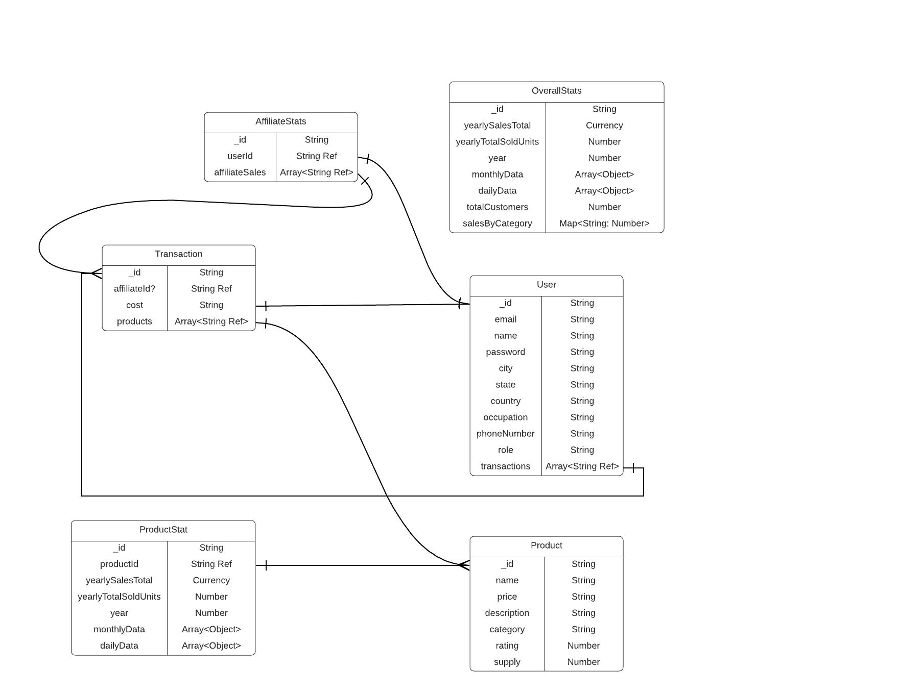

# Sales Vision

An App that allows the user to monitor the company sales, transactions, statistics and customers. The user can choose to use the web app with Dark or Light mode. It is built using React, Redux, Material UI, Nivo charts, Express and MongoDB.

## Local Installation & Set Up

1. Ensure that [nvm](https://github.com/nvm-sh/nvm), [npm](https://www.npmjs.com/) and Nodemon are installed globally

2. Create a `.env` file in the server folder and a `.env.local` in the client folder. These two files will be based on the `.env.example` and must contain your unique values.

3. Install the correct version of Node running this command in the project root folder

   ```shell
   nvm install
   ```

4. Install the dependencies in the server and client folder

   ```shell
   npm install
   ```

5. Run the Node server

   ```shell
   npm run dev
   ```

6. Run the React app
   ```shell
   npm start
   ```

## Entity Relationship Diagram (ERD)


